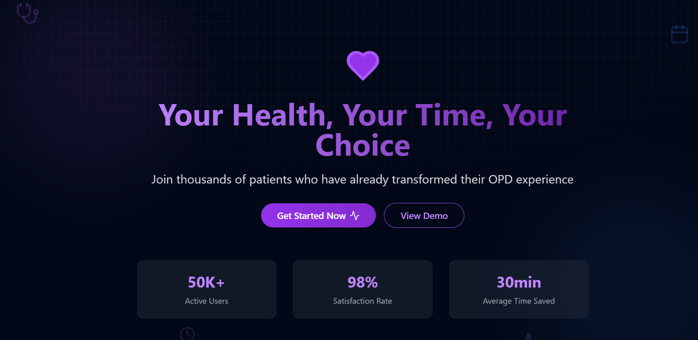

<div align="center"> 
  <h1 align="center">Visit Now </h1>
   <br />
      
    </a>
  <br />
  <div>
    
    
  </div>


</div>

## <a name="introduction">🤖 Introduction</a>

The Medical App is a web application built with React, TailwindCSS, and Supabase, aimed at reducing patient wait times for Outpatient Department (OPD) services. Designed with a modern interface, the app enables patients to track real-time OPD status, helping them avoid long queues by providing live updates on their expected turn time, especially during peak hours. This app also allows patients to browse doctors by department, hospital, or clinic, ensuring a seamless healthcare experience.


## <a name="tech-stack">⚙️ Tech Stack</a>

- React.js
- TailwindCSS
- Shadcn
- Framer Motion
- Tailwind CSS
- Postgresql
- Supabase

## <a name="features">🔋 Features</a>

👉 **User Authentication**: Secure sign-up and login using Supabase’s authentication services.

👉 **Bento Grid**: Modern layout presenting personal information using cutting-edge CSS design techniques.

👉 **3D Elements**:  Interactive 3D design elements, such as a GitHub-style globe and card hover effects, adding depth and engagement.

👉 **Appointment Booking**: Book, view, and manage appointments with healthcare providers.

👉 **Live OPD Queue Tracking**: Patients can see real-time updates on their turn in the OPD queue, helping them manage their time  

better.

👉 **Doctor Directory**: A comprehensive list of doctors with details on associated hospitals/clinics, years of experience, and patient 

ratings.

👉 **Real-Time Database Updates**: Live data updates from the database ensure accurate and up-to-date information on appointment status.

👉 **Responsiveness**: Seamless adaptability across all devices, ensuring optimal viewing experience for every user.

and many more, including code architecture and reusability 

## <a name="quick-start">🤸 Quick Start</a>

Follow these steps to set up the project locally on your machine.

**Prerequisites**

Make sure you have the following installed on your machine:

- [Git](https://git-scm.com/)
- [Supabase](https://supabase.com/)
- [vite]
- [npm](https://www.npmjs.com/) (Node Package Manager)

**Cloning the Repository**

(https://github.com/mohdslmn/VisitNow.git)

```bash
git 
cd portfolio
```

**Installation**

Install the project dependencies using npm:

```bash
npm install
```
**Copy Supabase Connection URL in ENV file**

```VITE_SUPABASE_URL=your-supabase-url
```VITE_SUPABASE_ANON_KEY=your-anon-key

**Running the Project**

```bash
npm run dev
```

Open [http://localhost:5173](http://localhost:5173) in your browser to view the project.
